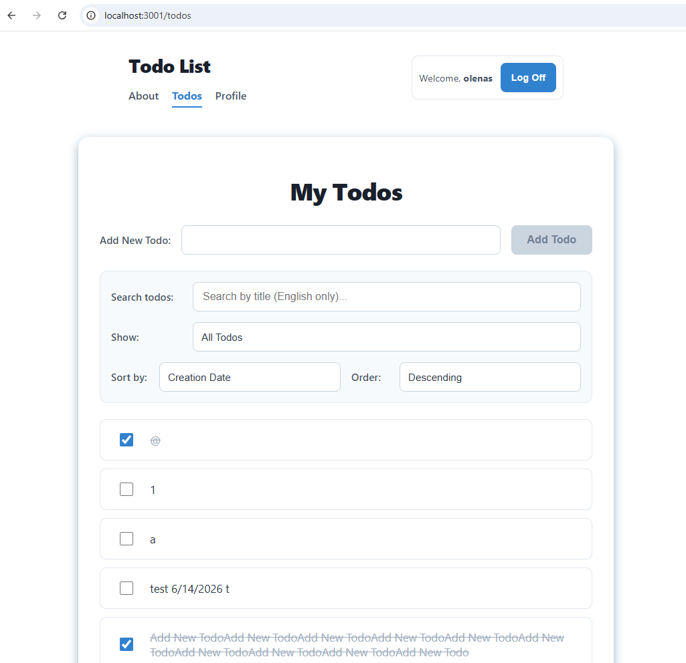
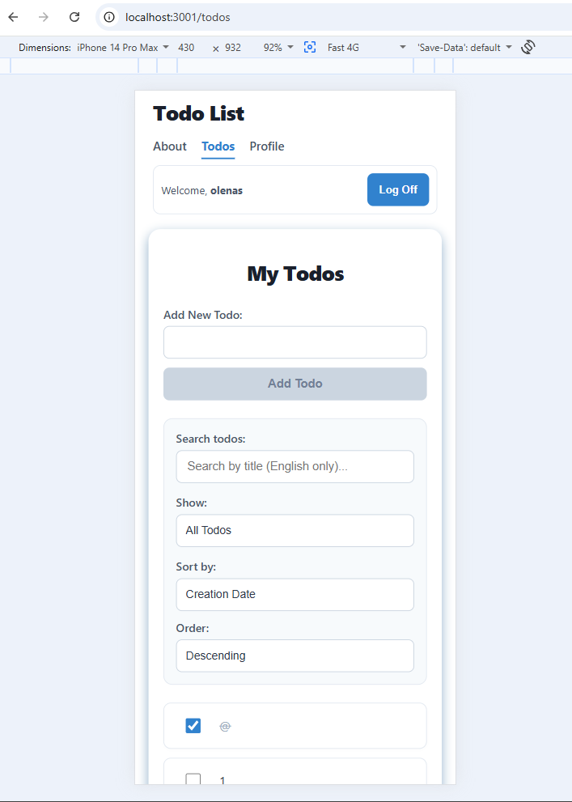

# React Todo Application

## 🔗 Live Application Link
- **Repository Demo**: [Olena Salnikova GitHub Application] (https://github.com/Olena-Salnikova/olena-salnikova-react-todo-list)

A modern, high-performance Todo management application built with React 18 and Vite. This application features comprehensive CRUD functionality, dynamic client-side filtering, and asynchronous caching state patterns. It is fully polished for production with custom styling architecture, mobile-first responsive design, and defensive client-side security measures.

## 📸 Technical Showcase
*(Tip: Take 2 screenshots of your working app—one desktop, one mobile viewport emulation—and save them into a folder named `screenshots` inside your repository, then uncomment the paths below!)*




## ✨ Core Features
- **Full CRUD Support**: Effortlessly create, read, update title inline, and delete/complete todo items.
- **Dynamic Routing & Filtering**: Seamless navigation between views using strict URL query parameters (`?status=all`, `?status=active`, `?status=completed`).
- **Debounced Text Search**: Optimized local list filtering powered by a custom asynchronous debounce pattern to eliminate rendering bottlenecks.
- **Defensive Input Security**: Two-tier protection implementing input string structure validation followed by deep HTML/Script entity stripping.
- **Aesthetic Empty States**: Conditional micro-copy layouts providing explicit user feedback when list queries return empty.

## 🛠️ Technologies & Tools Used
- **Core Library**: React 18 (Hooks applied: `useReducer`, `useEffect`, `useRef`, `useMemo`, `useCallback`)
- **Routing Engine**: React Router v6+
- **Build Ecosystem**: Vite Tooling Pipeline
- **Styling Paradigm**: CSS Modules (Locally scoped, BEM-inspired composition layout)
- **Security Engineering**: DOMPurify Integration
- **Quality Standards**: ESLint Core Configuration

## 🏗️ Architecture & Design Decisions
- **CSS Modules**: Chosen to safeguard the application against global namespace contamination. Every visual view maps strictly to isolated components, allowing scalable refactoring.
- **Accessibility & Mobile First**: Every interaction point (such as state check actions and submit buttons) maintains a physical bounding footprint of at least **44px** to ensure fluent mobile touchscreen tracking and keyboard input focus layout compliance.
- **Secure Error Architecture**: Technical logs and underlying system stacks are strictly abstracted away from production rendering context to completely prevent platform surface vulnerabilities.

## 🚀 Installation & Local Launch

1. Clone the repository and navigate into the target folder:
   ```bash
   git clone https://github.com/Olena-Salnikova/olena-salnikova-react-todo-list
   cd olena-salnikova-react-todo-list
   ```

2. Checkout to the evaluation branch:
   ```bash
   git checkout lesson-11
   ```

3. Install required production packages and dependencies:
   ```bash
   npm install
   ```

4. Boot up the Vite local node server context:
   ```bash
   npm run dev
   ```

5. Open your local browser environment to verify execution:
   `http://localhost:3001/`

## 🔮 Future Roadmap Enhancements
- Integrate full end-to-end unit testing scripts via Vitest and React Testing Library profiles.
- Implement Progressive Web App (PWA) manifest specifications for completely offline utility tracking.
- Build custom global theming tokens to toggle dark/light layout context dynamically.

## 📄 License
This codebase is distributed openly under the provisions of the MIT License.
